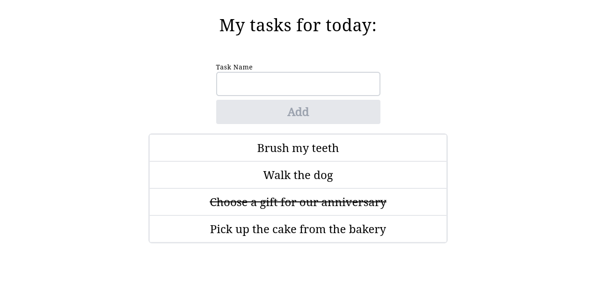

# React TODO app example
This is a project for my porfolio :)

## Running the app
#### Backend
```bash
$ cd backend
$ go build -o bin && bin/todo-app
```
#### Frontend
```bash
$ cd fronend
$ npm start
```

## Here is how it looks:


